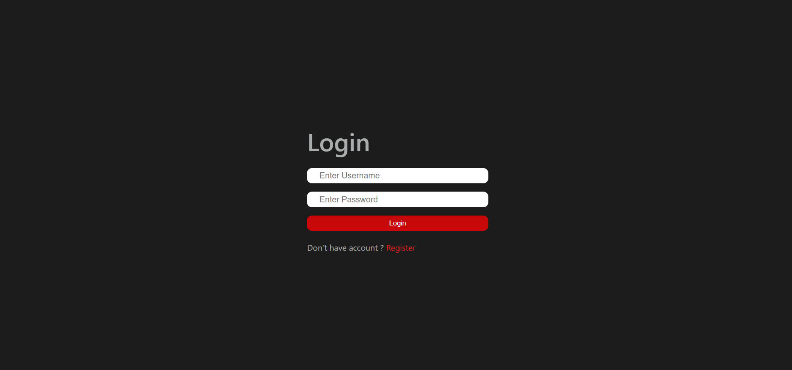
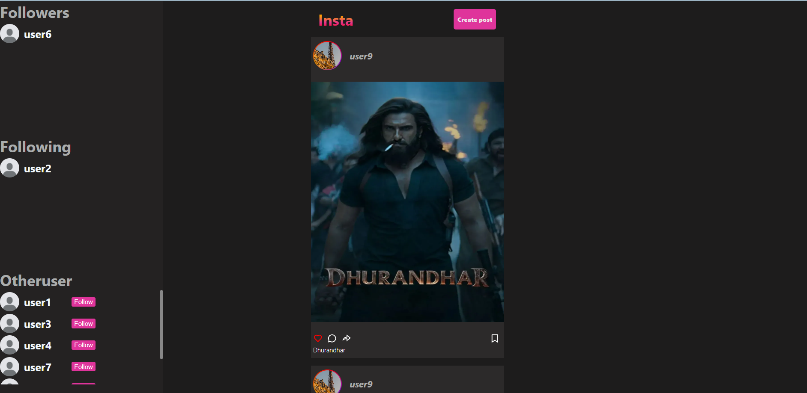

# 📸 Full Stack Instagram Clone (Production-Level App)

A full-stack Instagram clone built using modern web technologies with a scalable backend architecture and feature-based frontend structure.

🌐 **Live:** https://full-stack-insta.onrender.com
📦 **GitHub:** https://github.com/Notanormaldev/Full-stack-insta

---

## 🧠 Architecture (Industry Inspired)

This project follows a structured backend architecture:

```bash
Routes → Controllers → Models → Database
```

* 🔹 Clean separation of concerns
* 🔹 Scalable & maintainable code
* 🔹 Real-world backend flow

---

## 📸 UI Preview

### 🔐 Login Page



---

### 🏠 Feed Page



---

## 📁 Folder Structure

### 🔥 Backend

```bash
Backend/
├── public/
├── src/
│   ├── config/
│   ├── controllers/
│   ├── middleware/
│   ├── models/
│   ├── Routes/
├── app.js
├── server.js
```

---

### ⚛️ Frontend (Feature-Based)

```bash
Frontend/src/
├── features/
│   ├── auth/
│   ├── follow/
│   ├── posts/
├── shared/
├── App.jsx
├── app.routes.jsx
```

---

## 🔌 API Documentation

### 👤 Auth APIs

```bash
POST   /register       → Register user
POST   /login          → Login user
GET    /getme          → Get current user
```

---

### 👥 Follow APIs

```bash
POST   /follow/:username     → Follow user
POST   /unfollow/:username   → Unfollow user
GET    /pending/reqs         → Pending requests
PATCH  /accpet/:username     → Accept request
PATCH  /reject/:username     → Reject request
GET    /getfollowdets        → Followers & following
GET    /otheruser            → Get other users
```

---

### 📸 Post APIs

```bash
POST   /                     → Create post (image upload)
GET    /                     → Get user posts
GET    /details/:postid      → Post details
POST   /like/:postid         → Like post
POST   /unlike/:postid       → Unlike post
GET    /feed                 → Get feed
```

---

## 🔐 Authentication Flow

* JWT token generated on login
* Stored in frontend
* Sent in headers
* Verified using `idetifyuser` middleware

---

## ⚙️ Tech Stack

### Frontend

* React.js
* Context API
* Axios
* CSS / SCSS

### Backend

* Node.js
* Express.js
* MongoDB
* Mongoose
* Multer (image upload)

---

## ⚡ Features

* 🔐 Authentication system
* 👥 Follow / Unfollow
* 📸 Post upload with image
* ❤️ Like / Unlike
* 🧵 Feed system
* 📦 Feature-based frontend

---

## 🌍 Deployment

* Hosted on Render
* Frontend served via Express
* SPA routing handled:

```js
app.use("*", (req, res) => {
  res.sendFile("index.html");
});
```

---

## 🧪 Run Locally

```bash
git clone <repo>
cd Backend
npm install
npm start

cd Frontend
npm install
npm run dev
```

---

## 🔮 Future Scope

* Realtime chat
* Notifications
* Stories feature
* AI feed ranking

---

## 🧑‍💻 Author

Built with ❤️ using real-world full stack practices.
